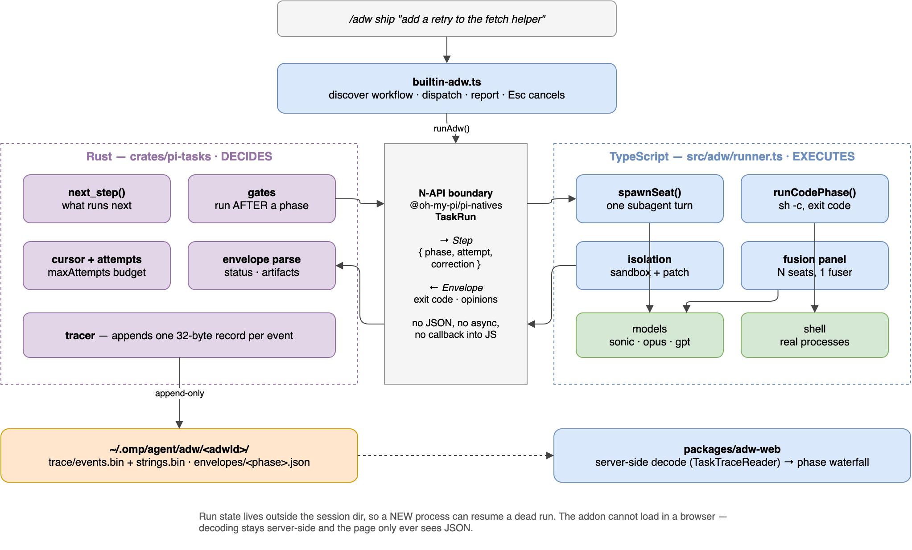
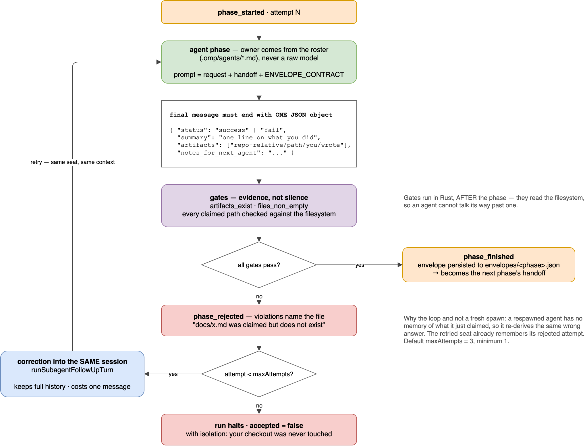
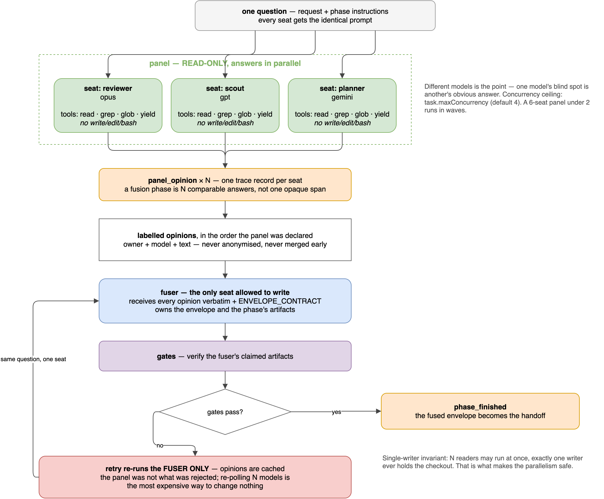
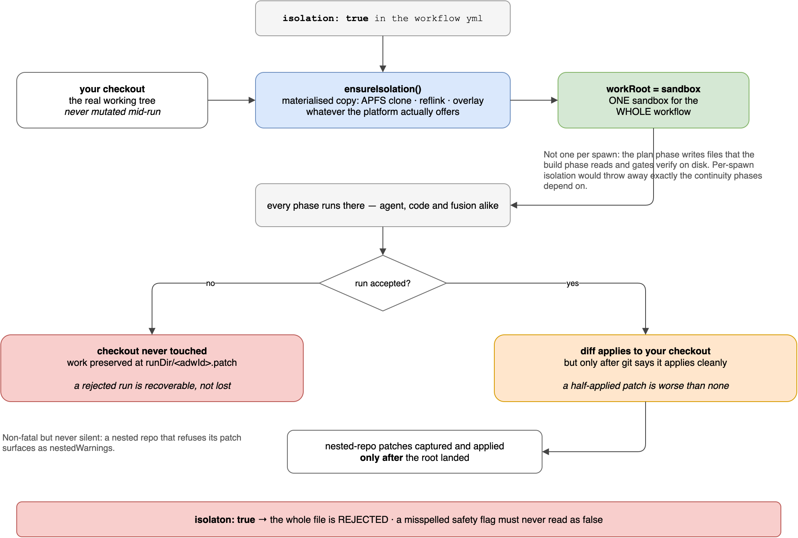
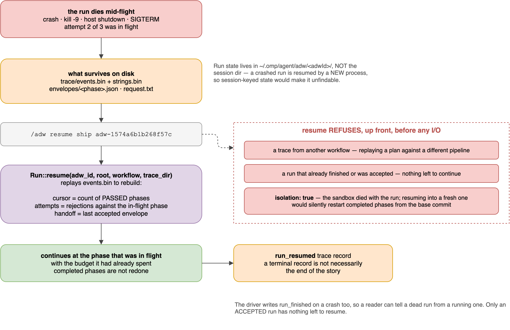

# AI Developer Workflows (ADW)

An **AI developer workflow** is an ordered list of phases declared in `.omp/adw/<name>.yml` and executed by `/adw <workflow> <request>`. The point is a division of labour: **deterministic code decides what runs next and whether it counts; models only do the work inside one bounded phase.** An agent proposes, code disposes.

That is the difference between a workflow and a long prompt. A long prompt asks one model to plan, build, verify and remember to verify. A workflow makes the *engine* responsible for sequencing, retries and acceptance, so the model cannot skip the check that would have caught it.

## Key implementation files

| Path                                                     | Role                                                                            |
| -------------------------------------------------------- | ------------------------------------------------------------------------------- |
| `crates/pi-tasks/src/orchestrator.rs`                    | The driven state machine: cursor, attempts, acceptance, resume                  |
| `crates/pi-tasks/src/envelope.rs`                        | Typed agent handoff envelopes and their parse rules                             |
| `crates/pi-tasks/src/gate.rs`                            | Acceptance gates (`artifacts_exist`, `files_non_empty`)                         |
| `crates/pi-tasks/src/trace.rs`                           | Append-only binary event log plus interned string table                         |
| `crates/pi-natives/src/tasks.rs`                         | N-API surface — `TaskRun`, `taskGateNames()`, `taskTraceLayout()`               |
| `packages/coding-agent/src/adw/runner.ts`                | The driver: spawns seats, runs code phases, owns isolation                      |
| `packages/coding-agent/src/adw/config.ts`                | Workflow discovery, parsing and validation                                      |
| `packages/coding-agent/src/adw/prompt.ts`                | Phase, panel and fusion prompt assembly; `ENVELOPE_CONTRACT`                    |
| `packages/coding-agent/src/adw/types.ts`                 | The on-disk schema                                                              |
| `packages/coding-agent/src/slash-commands/builtin-adw.ts` | `/adw`, `/adw list`, `/adw cancel`, `/adw resume`                               |
| `packages/adw-web`                                       | Read-only trace viewer                                                          |

## The split: Rust decides, TypeScript executes



The engine is **driven, not autonomous**. It answers two questions — *what runs next* and *did that count* — and the caller executes the step and reports back:

```text
Rust                                    TypeScript
next_step()  ──── Step ─────────────▶   spawn a seat / run a command
                                        (only the TS layer can reach a model)
gates(envelope) ◀── Envelope ───────    submit the result
```

The split is not stylistic. Only the TypeScript layer owns model providers and sessions, so Rust cannot call a model — which means the engine needs no async runtime, no callback into JS, and no `tokio`. It is a synchronous state machine, and that is what makes it testable without a fake model client.

Values cross as `#[napi(object)]` structs through V8 accessors, not as JSON strings.

## Writing a workflow

Workflows are discovered from `.omp/adw/*.yml`, project directories first (nearest wins), then user-level — the same precedence as agent discovery in `.omp/agents/*.md`. A repo carries its own factory.

```yaml
name: ship
description: Plan, implement, verify — with a second opinion on the design
maxAttempts: 3
isolation: true

phases:
  - name: design
    kind: fusion
    description: Two models argue the approach, one writes it down
    gates: [artifacts_exist, files_non_empty]
    panel:
      - owner: reviewer
        model: anthropic/claude-opus-4-5
      - owner: scout
        model: openai/gpt-5.5
    fuser:
      owner: task
      thinking: high

  - name: build
    kind: agent
    owner: task
    prompt: Implement the plan from the previous phase. Do not redesign it.
    gates: [artifacts_exist]

  - name: verify
    kind: code
    owner: bun
    command: bun test
    timeoutMs: 600000
```

### Workflow keys

| Key           | Required | Meaning                                                                 |
| ------------- | -------- | ----------------------------------------------------------------------- |
| `name`        | yes      | The name `/adw <name>` dispatches on                                    |
| `phases`      | yes      | Ordered list; phase names must be unique                                |
| `description` | no       | Shown by `/adw list`                                                    |
| `maxAttempts` | no       | Attempts per phase before the run halts. Default `3`, minimum `1`       |
| `isolation`   | no       | Run the whole workflow against a materialised copy of the repo          |

### Phase keys

| Key           | Applies to      | Meaning                                                                    |
| ------------- | --------------- | -------------------------------------------------------------------------- |
| `name`        | all             | Unique within the workflow; also the trace and envelope key                |
| `kind`        | all             | `agent` \| `code` \| `fusion`                                              |
| `owner`       | `agent` (req.)  | An agent from the roster — never a raw model                               |
| `owner`       | `code`          | A subsystem label for the report (`git`, `bun`, `sh`)                      |
| `gates`       | all             | Checks run *after* the phase against what it claimed                       |
| `description` | all             | Surfaced in progress output and the trace                                  |
| `model`       | `agent`         | Model pattern — `provider/id[:level]` or a `@role` alias                    |
| `thinking`    | `agent`         | `off\|minimal\|low\|medium\|high\|xhigh\|max\|auto`                        |
| `prompt`      | `agent`         | Extra instructions appended after the operator's request                   |
| `command`     | `code` (req.)   | Shell command; exit code `0` is the pass                                   |
| `timeoutMs`   | `code`          | Per-command deadline. Defaults to 10 minutes; must be `> 0`                |
| `panel`       | `fusion` (req.) | Two or more read-only seats answering the same question                    |
| `fuser`       | `fusion` (req.) | The single seat allowed to write                                           |

A misspelled key fails the file. Every schema uses `onUndeclaredKey("reject")`, because `isolaton: true` parsing cleanly would run the whole workflow against the real checkout while the operator believes it is sandboxed. Silence is the wrong answer for a safety flag.

Validation also rejects, with the offending phase named: a duplicate phase name, an `agent` phase with no `owner`, a `code` phase with no `command`, `model`/`thinking`/`prompt` on a `code` phase, a `fusion` phase with fewer than two panel seats or no fuser, `panel`/`fuser` on a non-fusion phase, `timeoutMs <= 0`, and an unknown gate name.

## Commands

```text
/adw <workflow> <request>          run a workflow
/adw list                          list discovered workflows and any broken files
/adw cancel                        stop the running workflow
/adw resume <workflow> <adw-id>    continue a run that died mid-flight
```

`Esc` also cancels a run in flight. A workflow spends minutes to hours across several models, and `Esc` is the key an operator actually reaches for.

`/adw list` reports files that **failed to load** alongside the workflows that parsed. A broken file the operator is about to ask for by name has to explain itself rather than read as absent.

## Phase kinds

### `agent`



One seat, one turn. `owner` names an agent from the roster, so the roster stays the source of truth for who the agent is; a phase may pin a `model`, but it does not invent an agent.

The prompt the seat receives is the operator's request, plus the previous phase's handoff, plus the envelope contract.

### `code`

A shell command run with `sh -c`. The exit code is the verdict — no model, no tokens, no envelope. Deterministic work belongs here: `git commit`, `cargo check`, `bun test`.

Signals are reported as signals. A command killed by `SIGTERM` says so instead of surfacing as `exited 143`, and a run cancelled by `Esc` is never labelled a timeout.

### `fusion`



Two or more models answer the same question read-only and in parallel, then a single **fuser** merges every labelled opinion and owns the phase's envelope. Panel seats are pinned to `read`, `grep`, `glob` and `yield` — no `write`, `edit` or `bash`, and no nested spawns — which is what makes running them concurrently safe.

Opinions reach the fuser **labelled and in the order the panel was declared**, never anonymised and never merged early. Panel concurrency respects `task.maxConcurrency` (default 4), so a six-seat panel under a ceiling of two runs in waves.

A retried fusion phase re-runs **the fuser only**. The opinions are cached: the panel was not what got rejected, and re-polling N models is the most expensive way to change nothing.

## Envelopes

An agent's only structured output channel is the last complete top-level JSON object in its final message. Everything before it — prose, fences, reasoning — is ignored, so an agent that narrates before answering still produces a parseable envelope. A *missing* object is a contract violation.

```json
{
  "status": "success",
  "summary": "one line on what you did",
  "artifacts": ["repo-relative/path/you/actually/wrote"],
  "notes_for_next_agent": "what the next phase needs to know",
  "...": "any fields your phase is asked to report"
}
```

`"status": "fail"` is a real answer, not an error: it reaches the next attempt with the summary attached. Claiming success you cannot back is the failure mode the gates exist to catch.

An accepted envelope is persisted to `<traceDir>/envelopes/<phase>.json` and becomes the next phase's handoff. It is the one thing the event trace cannot reconstruct, which is why it is written to disk rather than kept in memory.

## Gates

Gates verify claims; they never predict. They run **after** a phase, in Rust, against the filesystem — so a gate reads what the envelope actually declared and checks whether it is true.

| Gate                  | Passes when                                                                          |
| --------------------- | ------------------------------------------------------------------------------------ |
| `artifacts_exist`     | every path in `artifacts` exists on disk                                             |
| `files_non_empty`     | every path in `artifacts` exists **and** has non-zero size                            |
| `diff_matches_claims` | every path the working tree changed is one some phase declared                        |

`passed` is evidence rather than silence: a gate reports what it examined, so a phase that declared no artifacts cannot pass by claiming nothing. Gate names are validated at load time against `taskGateNames()`, the same list the engine builds from — a new gate in Rust needs no matching edit in TypeScript to be accepted.

### `diff_matches_claims`

The first two catch a claim with no file. This catches the opposite — **a file with no claim**. An agent that edited three files and confessed one leaves two changes nobody reviewed, and an existence check cannot see them, because nothing was claimed.

The allowed set is cumulative, so no phase is blamed for another's work:

```text
allowed   = dirty before the run started
          ∪ paths declared by earlier phases
          ∪ paths declared by this envelope
violation = git status (untracked included) − allowed
```

Whatever was already dirty belongs to the operator, not the agent. Untracked files are listed individually rather than collapsed into their directory, because a brand-new undeclared file is the common case. A rename reports both paths: a file moved out from under a claim is exactly what this gate is for.

It lives in `crates/pi-natives`, not `pi-tasks`, because it needs git — the engine crate stays free of I/O beyond the filesystem. And a gate that cannot gather evidence **fails**: run it outside a repository and it reports `not a repository`, never a quiet pass.

## Corrections and retries

A rejected attempt does **not** respawn the agent. It continues the seat's existing session through `runSubagentFollowUpTurn`, so the correction arrives as the next user turn in the same context window:

- The seat still remembers the attempt that was rejected, so it can fix *that* instead of re-deriving it.
- A retry costs one message instead of a cold restart.
- Seat ids are stable across attempts, which is what makes the continuation possible.

Violations name the file: *"docs/x.md was claimed but does not exist"* is actionable; *"the file you claimed is missing"* is barely so.

When a phase exhausts `maxAttempts`, the run halts with `accepted = false`. It is a decided outcome with a trace, not a crash.

## Isolation



`isolation: true` runs the **whole workflow** against one materialised copy of the repo — APFS clone, reflink, or overlay, whichever the platform offers.

One sandbox per run, not one per spawn: a `plan` phase writes files that a `build` phase reads and gates verify on disk. Per-spawn isolation would destroy exactly the continuity the phases depend on.

On accept, the diff is applied to your checkout — but only after git confirms it applies cleanly, because a half-applied patch is worse than none. On reject, the checkout is never touched and the work survives as `runDir/<adwId>.patch`. Nested-repo patches are captured and applied only *after* the root landed; a nested repo that refuses its patch is non-fatal but never silent, surfacing as `nestedWarnings`.

## Resume



A run that dies mid-flight is resumable, because the trace is the record:

```text
/adw resume ship adw-1574a6b1b268f57c
```

`Run::resume` replays `events.bin` and rebuilds the cursor from the count of passed phases, the attempt tally from the rejections against the phase that was in flight, and the handoff from the last accepted envelope. The run continues at the phase that died, with the budget it had already spent — completed phases are not redone. A `run_resumed` record marks the seam, because after it a terminal record is no longer the end of the story.

Run state lives in `~/.omp/agent/adw/<adwId>/`, deliberately **outside** the session directory: a crashed run is resumed by a new process, so session-keyed state would make the dead run unfindable by exactly the caller that needs it.

Resume refuses, before any I/O:

- a trace belonging to a **different workflow**, or one whose phases do not match position-for-position — replaying a plan against a different pipeline would replay decisions nobody made about those phases;
- a run that already **finished or was accepted** — there is nothing left to continue;
- a run with `isolation: true` — the sandbox was torn down with the run, and resuming into a fresh one would silently restart completed phases from the base commit.

The driver writes a terminal record on a crash too, so a reader can tell a dead run from a running one.

## The trace format

Every event is one fixed-stride binary record. Text was the wrong wire: a JSONL line re-spells `"kind":"phase_started"` on every event and forces a parse per line on every reader poll.

```text
events.bin    magic "PITR", 16-byte header, then 32-byte records
strings.bin   magic "PIST", content-interned strings addressed by u32 id
```

| Offset | Size | Field                        |
| ------ | ---- | ---------------------------- |
| 0      | 8    | timestamp, unix millis       |
| 8      | 1    | event kind                   |
| 9      | 1    | flags — bit 0 = `ok`         |
| 10     | 2    | attempt                      |
| 12     | 4    | phase — string id            |
| 16     | 4    | owner — string id            |
| 20     | 4    | gate — string id             |
| 24     | 4    | detail — string id           |
| 28     | 4    | value — counter              |

A reader seeks event `n` at `HEADER_LEN + n * RECORD_LEN` and tails by byte offset with zero parsing: cursor, byte offset and sequence number are the same number. String id `0` is the empty string and is never written, so an absent field costs nothing. The run id is the *directory*, not a field — what the key already tells you is not repeated per record.

The encoding is the ABI. `taskTraceLayout()` exports the offsets so a reader in another language uses them directly instead of duplicating the layout; there is no `unsafe` and no transmute, only explicit `to_le_bytes`, so the layout is identical on every target.

Event kinds: `run_started`, `phase_started`, `phase_retry`, `gate_check`, `phase_rejected`, `phase_finished`, `run_finished`, `panel_opinion`, `run_resumed`, `phase_tokens`.

`panel_opinion` exists because the fan-out happens in the caller — only it can spawn a model. Without that record a fusion phase would be one opaque span instead of N comparable answers.

`phase_tokens` is what an attempt cost, reported by the caller for the same reason. It is charged **per attempt, before the verdict**, because a rejected attempt spent real tokens: a run whose cost counted only its successes would hide the retries that made it expensive. In a measured two-attempt run the rejected try cost 25,561 tokens against the accepted one's 26,059 — charging only the winner would have understated the run by half. It needs its own record because `value` already carries the violation count on both rejection paths.

## Viewing a run

`packages/adw-web` serves a read-only waterfall of any run under `~/.omp/agent/adw/`:

```bash
cd packages/adw-web && bun server.ts     # http://localhost:4600
```

| Endpoint          | Returns                                             |
| ----------------- | --------------------------------------------------- |
| `GET /api/runs`   | every run: workflow, duration, verdict, event count |
| `GET /api/runs/:id` | decoded events plus a per-phase timeline           |

Decoding stays server-side behind `TaskTraceReader`. The native addon cannot load in a browser, so the page only ever receives JSON — the alternative would be a second implementation of the record layout in JavaScript, free to drift from the ABI.

## Diagram sources

The diagrams above are exported from checked-in [draw.io](https://www.drawio.com/) sources sitting next to them in `assets/adw/`. Edit the `.drawio`, then re-export — draw.io writes PNG, and `cwebp -lossless` gets the same pixels in a third of the bytes:

```bash
drawio --no-sandbox --export --format png --scale 2 \
  --output /tmp/01-architecture.png assets/adw/01-architecture.drawio
cwebp -lossless /tmp/01-architecture.png -o assets/adw/01-architecture.webp
```

Rendered images are committed, not generated at build time, so the docs read correctly on GitHub without a toolchain. The `.drawio` files are the editable source of truth — do not hand-edit the `.webp`.
