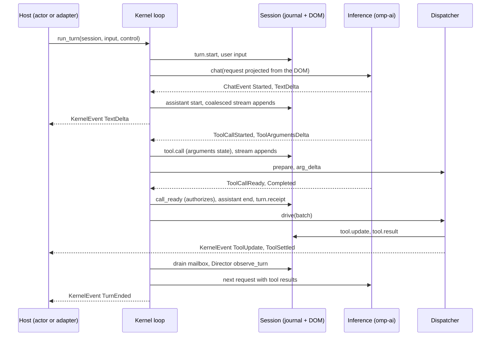
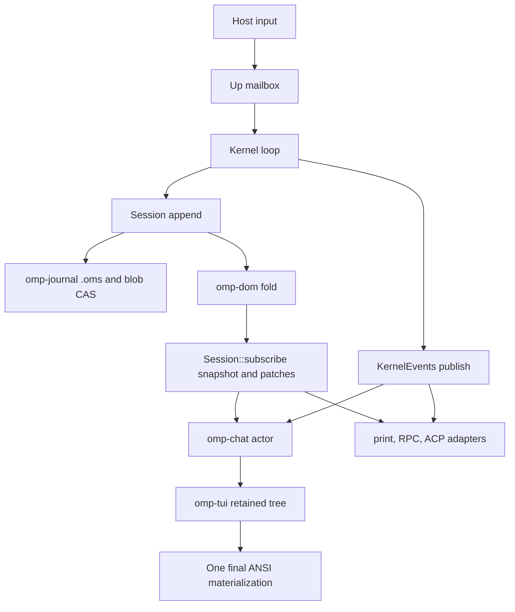

# Agent loop

The agent loop is the journal-first owner of one explicit turn: it takes a caller's input, projects
the session tree into a provider request, folds the streamed response into the tree, executes the
tool calls the model named, and decides whether to resample or yield. It is `Kernel<C: Inference>`
in `crates/agent/src/loop.rs`. The kernel is transport-neutral: the driver composes it
(`compose_kernel`, `crates/driver/src/headless/kernel.rs`), and `crates/app` and `crates/chat`
present it. Process placement and protobuf transport boundaries are described in
[`processes.md`](processes.md).

The authority is the session. Every fact the loop produces is appended to the `.oms` journal through
`omp_session::Session` and folded into the `omp-dom` tree before anything observes it
([ADR 0003](../adr/0003-one-authoritative-session-tree.md)). The loop keeps no parallel mutable
copy of turn state: pending steering, the paused flag, jobs, approvals, and Director engagements are
all read back from the DOM, so `replay(journal) == state` holds across a crash or a session switch.

## Composition and ownership

`Kernel::new(client, registry, policy, prompt)` takes an `Inference` implementation, the tool
`Registry`, a `DispatchPolicy`, and a `PromptSource`. It owns:

- the `Inference` client (`omp_ai::Client` implements it: `chat`, `chat_on` for an isolated
  second-model call, route facts, `begin_turn`, and the retry sink);
- a `Dispatcher` that prepares, drives, and journals tool calls, and the `JobBoard` it shares;
- a `CancelTree` (session root; each turn begins a `TurnCancellation` child);
- one unbounded `flume` mailbox of `Up` messages, whose sender `Kernel::mailbox()` hands out;
- `KernelEvents`, the ephemeral fan-out behind `Kernel::subscribe()`;
- a `DirectorRegistry` (the standard roster plus host additions), the live extension `Component`
  reducers, an optional `LifecycleHooks` gate, the `ApprovalDesk`, and `RuntimeFlags`.

The caller owns the `Session`. Every entry point takes `&mut Session`, so the kernel is the only
writer while a turn runs and actors never hold it
([ADR 0005](../adr/0005-controller-actor-separation.md)). `omp-chat` and the print, RPC, and ACP
adapters consume `Session::subscribe()` (a snapshot plus an ordered patch stream) and
`Kernel::subscribe()`; they send input back only as `Up` messages.

The driver supplies policy rather than adding it to the loop: convars (`with_con_context`), the hook
gate, the tool-admission policy, the external (worker or remote) tool executor, session tools such
as `task`, the file-mention source, and the Director registry. See [`extensions.md`](extensions.md)
for how extension hooks, Directors, and Components reach the kernel.

## Entry points

| Method | Starts |
|---|---|
| `run_turn(session, TurnInput, RunControl)` | An ordinary user turn (text plus content-addressed attachments). |
| `run_authored_turn` | The same, with an authenticated collaboration author recorded on the user node. |
| `run_skill_turn` | A discovered skill invocation as one typed user turn. |
| `run_custom_turn` | An extension-authored message as model-visible developer context. |
| `retry_tool_tail(session, RunControl, RetryConfirmation)` | Re-executes an aborted tool tail without a model round trip, after rewinding the journal to just after the batch was authorized. A tail holding a call recovery settled as `Abort::EffectsUnknown` (it had started, so it may already have run) is not re-run unless the caller passes `RetryConfirmation::EffectsUnknown`: the default returns `RetryOutcome::NeedsConfirmation { calls }` (call id, name, intent) and touches nothing. A tail of never-started `Skipped` calls retries without confirmation. |
| `compact`, `compact_with` | The manual compaction path between turns (`/compact`, `/handoff`). |

`RunControl` carries the caller's `CancellationToken`, an optional deadline, and an optional request
budget (with a soft-budget wrap-up notice). The result is a `TurnOutcome` whose `TurnStop` is
`Completed`, `Cancelled`, `Steered`, or `Failed`; `Failed` is reported only through
`KernelEvent::TurnEnded`, while `run_turn` returns the `KernelError` itself. User-local `!` and `$`
runs (`crates/agent/src/local.rs`) reuse the dispatcher but never call inference.

## One turn

`run_explicit_turn` flushes host session state, runs the `before_agent_start` hook gate when
subscribed, begins a turn cancellation scope, appends `turn.start` and the user input (plus file
mentions) to the journal, and enters `run_turn_body`. When the body returns, the loop settles
pending peer-reply obligations, `finish_turn` journals an interrupt or error notice if needed,
publishes `KernelEvent::TurnEnded`, re-derives host state from the tree, and emits `agent_end`.

`run_turn_body` is a loop. Each iteration is one inference request plus its tool batch:

1. **Admission.** Cancellation and the run deadline are checked. `drain_admission_control` applies
   only the control that must preempt provider admission (`Up::Pause`, `Up::Cancel`) and re-queues
   the rest. `hold_while_paused` parks while the journal-derived pause gate is active.
2. **Safe-point housekeeping.** Directors may hand off at a settled boundary. Settled background
   jobs and subagents are delivered as one `jobs.async-result` patch (the notice and the delivery
   markers are a single journal entry, so a crash cannot deliver twice). Steering already queued is
   consumed into the turn so the model never answers a stale request.
3. **Projection.** `project_request` builds the working copy of the request from the tree: system
   items from the `PromptSource`, the mode prompt, the projected thread, vision lowering, and the
   advertised tool roster (allowlist, goal, `think`, and recursion-ceiling filters). The
   `thread_projection` hook may patch that copy; the journal and DOM are untouched. The
   `turn_start` hook may narrow the enabled tools.
4. **Preflight Directors.** `before_inference` runs cold auxiliary work (for example compaction
   speculation), raced against cancellation and the mailbox. `prepare_inference` then refines the
   request synchronously, outermost Director first, and `watch_stream` opens request-scoped
   observers.
5. **Inference.** `Inference::chat` opens a `ChatStream` of canonical `omp_ai::ChatEvent`s. Provider
   frames are decoded inside `omp-ai`; the loop never sees vendor shapes. Opening the stream is
   itself raced against cancellation and the mailbox.
6. **Fold.** `drive_inference` (below) folds the stream into the tree.
7. **Tool batch.** If the response named tool calls, `Dispatcher::drive` runs them (below).
8. **Boundary.** The mailbox is drained at a safe point and steering is consumed. Directors observe
   the turn (`observe_turn`) and may hand off (`after_settled_turn`).
9. **Continue or yield.** A turn with tool calls (unless a terminal incremental yield was recorded)
   or with steering resamples. A `pause_turn` completion resamples up to
   `PAUSED_TURN_CONTINUATION_CAP`, the count re-derived from durable assistant evidence. An empty
   answer retries up to `EMPTY_OUTPUT_RETRY_CAP` times and then journals a cap notice. Owned
   background work that is still running makes the candidate yield a scheduling pause:
   `await_settlement` waits for a job, steering, or an interrupt. Otherwise the candidate yield goes
   to the `before_yield` hooks (the advisor's second-model review) and then to `on_yield`, which
   returns a `LoopDecision`. `Continue` resamples; `Yield` runs the `agent_settled` hook, which may
   demand another turn, and returns the outcome.

### The inference fold

`drive_inference` is one `select!` over cancellation, the mailbox, a coalescing commit timer, and
the stream, in that priority. Streamed text is journaled through `stream_coalesce` (one durable
append per window of deltas), and text still in the window is committed before anything the mailbox
records and before the streams close. The events it folds:

- `Started` opens `msg.assistant.start`. `TextDelta` and `ThinkingDelta` append to journaled
  streams and publish `KernelEvent::TextDelta` / `ThinkingDelta`.
- `ToolCallStarted` resolves the exact `ToolIdentity`, journals a `tool.call` in `arguments` state
  (`Session::call_streaming`), and opens a `PreparedCall` that consumes argument fragments live.
  Each `ToolArgumentsDelta` is journaled, forwarded to the prepared call's `IncomingParams` feed,
  and offered to Director stream observers.
- `ToolCallReady` is the sole executable signal. The tool-call hook gate may allow, deny, rewrite
  the target or arguments, or add approval requirements. `Session::call_ready` then journals the
  canonical arguments (the only authorization boundary) and `PreparedCall::commit` hands them to
  the unit. A call whose canonical arguments differ from what streamed is prepared again.
- `Completed` closes the assistant and journals the `turn.receipt`. Inline `<SM:EDIT>` regions in
  plain text can be recovered into a synthetic `edit` call.
- Provider workflow actions are executed on the live bidirectional session and answered there.

A Director stream observer can return `Interrupt`. The response then ends `interrupted`, its tool
calls settle as skipped placeholders (never as executed), the Director's durable effects commit, and
the loop resamples in the same turn, up to the `ai_stream_redirect_cap` convar. A cancel or scoped
abort during the fold settles every materialized call as skipped in the same way. A stream error
after complete tool calls keeps those calls and journals a notice instead of discarding them.

### Tool batches

`Dispatcher::drive(session, calls, control)` is one multiplexed loop over every call in the batch,
journaling each event as it arrives. Independent read-only calls run concurrently; a call that
mutates shared state is exclusive within its batch. Reports come back in batch order, and every
committed call settles through exactly one path: a typed terminal, a harness abort, or detachment
into the job primitive when it outlives `DispatchPolicy::blocking_limit`
([ADR 0010](../adr/0010-one-job-primitive.md)).

Before a call starts, native admission (`ToolAdmission`) and hook requirements are merged into at
most one durable approval prompt, and the call waits in `AwaitingApproval` until an `Up::Approve`
resolves it or the prompt's deadline applies its default decision. Tool implementations consume
`IncomingParams` and emit typed `Ev` streams (`crates/tool`). A terminal is a `CallOutcome`, and
output beyond the `DispatchPolicy` limits spills to a content-addressed artifact instead of being
truncated inside the tool. Each update journals a `tool.update` and publishes
`KernelEvent::ToolUpdate`; each terminal journals the result and publishes `KernelEvent::ToolSettled`.

## Mailbox and cancellation

There are two independent channels because they have different semantics.

### The `Up` mailbox

`Kernel::mailbox()` returns the sender of one unbounded `flume` channel of `Up`
(`crates/agent/src/steering.rs`). Producers never block, and the kernel is the only consumer. It
reads the mailbox wherever it can safely act: while opening inference, inside the stream fold, while
a tool batch runs, while paused, while awaiting a job, and at the boundary drains.
`CallControl::handle` is the single interpreter, so a message means the same thing everywhere:

- `Steer` and `SteerAuthored`: journaled into `<queues><steering>` on receipt (a crash never loses
  accepted input), then moved into the turn in one atomic patch at the next safe point. During a
  tool batch, steering skips every call that has not started.
- `SkillPrompt`, `Queue`, `Peer`: a skill prompt joins at the next safe point; `Queue` journals a
  follow-up prompt and `Peer` an inbox item, neither redirecting the active turn.
- `Pause`: flips the journal-derived pause gate; no continuation starts while paused.
- `AbortTools(ToolScopedAbortReason)`: interrupts identified calls without cancelling siblings.
- `Interrupt` and `Cancel`: cancel the turn scope, or the whole session.
- `Approval` and `Approve`: file and resolve journal-backed approval prompts.
- `SessionMutation`, `Env`, `Autoreply`, `Unqueue`, `Subscribe`: one-shot mutations and observations
  executed by the actor that owns the `Session`. A rewind additionally applies lifecycle work
  (removed subagents and jobs are terminated,
  [ADR 0004](../adr/0004-lifecycle-derives-from-the-tree.md)).

### Cancellation tree

`CancelTree` is the session root and `begin_turn` creates a `TurnCancellation`
(`crates/agent/src/cancel.rs`). Each tool scope carries two views of one stop
([ADR 0011](../adr/0011-cancellation-needs-a-kill-boundary.md)): a commit token, which for a
foreground mutation is session-only so a turn interrupt never tears an in-flight commit in half, and
an interrupt token, the host's stop request. On a stop the dispatcher gives the unit a cooperative
interrupt, waits `DispatchPolicy::interrupt_grace`, then terminates it and journals
`Abort::EffectsUnknown` rather than hiding the uncertainty as a generic error. A call that never
started settles as `Abort::Skipped`. `RunControl` adds the caller's token and deadline, which
`run_turn_body` races against every await.

## Directors and hooks

The loop is a generic hook surface. Behavior that keeps control across turns is a Director stack
that lives in the session DOM and that the loop only walks (`crates/agent/src/director.rs`, built-ins
in `crates/agent/src/directors/`, [ADR 0015](../adr/0015-directors.md)). The seams the kernel calls
are `before_inference`, `prepare_inference`, `watch_stream`, `observe_turn`, `after_settled_turn`,
`before_yield`, and `on_yield`. Directors claim exclusive `Slot`s (`mode`, `loop`, `tool_choice`,
`worktree`) and bind convars, which the loop applies before projection. Journal-derived durable
state that is not control flow is a `Component` reduced into `<meta>`; extension Components run live
through `apply_live_components` after each commit and replay applies their durable patch without
calling Python. The Python surface is documented in
[`docs/py/15-directors.md`](../py/15-directors.md).

`LifecycleHooks` (`crates/agent/src/hooks.rs`) carries the extension hook seams the loop notifies or
gates: `before_agent_start`, `agent_start` and `agent_end`, `turn_start` and `turn_end`,
`message_start`, `message_update` and `message_end`, `call_open`, `tool_call`,
`tool_execution_start` and `tool_execution_end`, `thread_projection`, and `agent_settled`. An
unsubscribed event constructs no payload. Extension loading and the CONTROL callback path are in
[`extensions.md`](extensions.md).

## Events, storage, and presentation

`KernelEvent` (`crates/agent/src/events.rs`) is ephemeral. The journal and DOM are authoritative and
dropping an event cannot change replay; events exist so hosts wake promptly. The variants are
`InferenceStarted`, `InferenceRetry`, `StreamRedirected`, `Usage`, `TextDelta`, `ThinkingDelta`,
`ToolReady`, `ToolUpdate`, `ToolSettled`, `ApprovalRequested`, `CompactionSpeculating`,
`CompactionSettled`, `JobsDelivered`, `WorkflowActionAnswered`, and `TurnEnded`.
`KernelEvents::publish` delivers each one to every subscriber over an unbounded `flume` channel.

Durability is never delegated to a subscriber. An actor takes `Session::subscribe()` (a `Snapshot`
and an ordered `omp_dom::Event` receiver) and keeps its own retained state. `omp-chat` projects that
DOM replica into transcript blocks (`crates/chat/src/project.rs`) and uses `KernelEvent`s only for
transient cues such as retry banners and the compaction gauge; the print, RPC, and ACP adapters
(`crates/app/src/print_mode.rs`, `rpc_mode.rs`, `acp_mode.rs`) translate the same two streams. On
resume the tree is rebuilt from the journal alone.

Transcript presentation (blocks, exactly-once history, append-only scrollback) is specified by
[ADR 0034](../adr/0034-transcript-is-a-protocol.md), and the retained TUI by
`crates/tui/README.md`.

## Failure and recovery invariants

- The user input and `turn.start` are durable before an inference attempt is driven. A response's
  `turn.receipt` is journaled when it completes, is redirected by a Director, or its stream closes
  early.
- A tool call is executable only after `Session::call_ready` journals its canonical arguments. A
  call that never reaches it is cancellation-safe and settles as a placeholder, never as a result
  the tool did not produce.
- Every committed call settles exactly once: a typed terminal, an abort, or detachment into a job.
  Uncertainty (`EffectsUnknown`) is data in the journal, not a missing event.
- Steering, follow-ups, approvals, and pause are journaled when accepted, not when consumed.
- Provider retry, rotation, and repair are `omp-ai` middleware below the `Inference` seam. The
  kernel owns only turn-level recovery: Director redirects, empty-output retry, `pause_turn`
  continuation, and compaction.
- Presentation loss cannot corrupt storage: events are ephemeral and every actor can rebuild from a
  snapshot plus the patch stream.

## Key files

| Component | Path |
|---|---|
| Turn kernel, `Inference`, `RunControl`, `KernelError` | `crates/agent/src/loop.rs` |
| `Up` mailbox messages, steering queue | `crates/agent/src/steering.rs` |
| Tool dispatch, `CallControl` | `crates/agent/src/dispatch.rs` |
| Cancellation tree | `crates/agent/src/cancel.rs` |
| Job board | `crates/agent/src/jobs.rs` |
| Director stack and built-ins | `crates/agent/src/director.rs`, `crates/agent/src/directors/` |
| Hooks | `crates/agent/src/hooks.rs` |
| Ephemeral events | `crates/agent/src/events.rs` |
| Approvals | `crates/agent/src/approvals.rs` |
| User-local `!` and `$` runs | `crates/agent/src/local.rs` |
| Journal-first session API | `crates/session/src/session.rs` |
| Canonical streamed events, Tower stack | `crates/ai/` |
| Kernel composition | `crates/driver/src/headless/kernel.rs` |
| Tool contracts and typed outcomes | `crates/tool/` |
| Chat actor and transcript projection | `crates/chat/src/host.rs`, `crates/chat/src/project.rs` |
| Python Director and Component contract | `docs/py/15-directors.md` |
