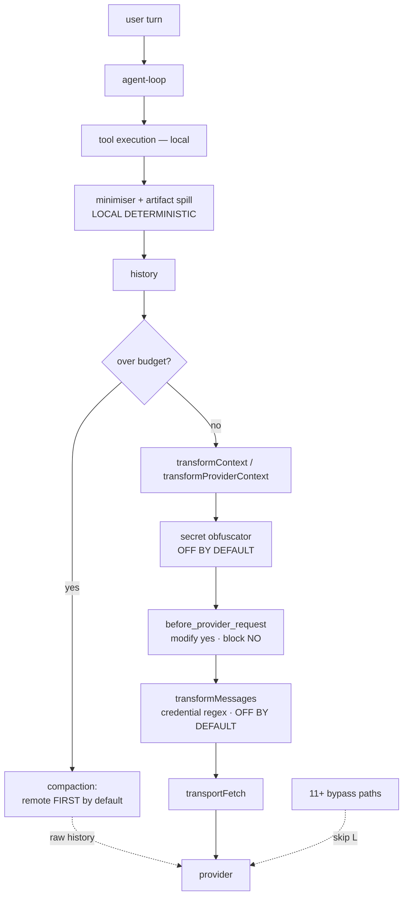

# Local-first audit: how much happens before data leaves the machine

Read-only audit of the OMP runtime and the ADW layer. Five evidence files sit
beside this one (`01`–`05`), each citing `file:line`; this is the synthesis.
Nothing was modified, committed or installed.

The question: **before a request reaches Anthropic, OpenAI, Gemini or any other
provider, how much selection, reduction, sanitisation and secret filtering
happens locally?**

---

## 1. Executive summary

OMP reduces tool output aggressively and by default, and it does so with local
deterministic code. That part is real, well-built, and better than the question
assumed.

Two other parts are not. **Compaction sends raw history to a remote model
first** — `remote` is the first entry in the default method order, ahead of the
two local methods that exist. And **secret redaction ships switched off**; with
stock settings both outbound filters are literal pass-throughs, so a `.env`, an
SSH key or a PEM file reaches the provider byte-for-byte.

The machinery to fix the second problem already exists and is mostly in the
right place. `before_provider_request` already sees the complete outbound
request and can already rewrite it. It cannot *block*, and restricted sessions
skip extensions entirely — including ADW's own panel seats. Those are two
specific, small gaps in an otherwise suitable seam, not an absent subsystem.

---

## 2. Final classification

**C — PARTIALLY LOCAL-FIRST.**

The evidence pulls in both directions and the honest answer is neither extreme:

- **Above B** because reduction is genuine, universal and default-on. Every tool
  result over 50 KB is replaced — not merely displayed shorter — by a
  head+tail+pointer view (`output-meta.ts:724-911`), and that replaced object is
  what becomes the message. A Rust semantic minimiser rewrites program output
  before it is sent. Reads are windowed and can be structurally summarised by a
  tree-sitter pass. None of that involves a network call.
- **Below D** because the largest single body of text — the conversation itself
  — defaults to leaving the machine uncompressed. `DEFAULT_COMPACTION_METHOD_ORDER`
  is `[remote, snapcompact, handoff, shake, soft]`
  (`session/compaction-methods.ts:44-50`, verified). The local methods are
  second and fourth. A `100 MB → provider → summary` flow is not local
  reduction, and that is the default path.
- **Far below E** because there is no enforced outbound policy at all. Redaction
  is off by default, fails open when on, and nothing anywhere can block a
  request on content.

`C` is the floor of honesty here, not a compromise: a system that reduces tool
results well and ships raw history by default is exactly "local execution plus
meaningful local selection", which is what C describes.

---

## 3. Architecture discovered

The dotted lines are the findings. Everything solid is working as intended.

---

## 4. Actual outbound data flow

`AgentMessage[]` → `prepareProviderCall` (`agent-loop.ts:1598`) → `transformContext`
→ `convertToLlm` → `transformProviderContext` (`sdk.ts:3447`, where the obfuscator
would run) → `streamSimple` → `withTransportFetch` → `streamDispatch` →
per-provider encoder → `transformMessages` (`transform-messages.ts:588`, where
credential redaction would run) → `onPayload` → provider HTTP client.

**Last modifiable point:** the closure in `utils/transport-fetch.ts:32-40`,
where `init.body` holds the serialised JSON. It currently only adds UA/CA/proxy.
The last *structured* point is the per-provider `onPayload` hook, which is more
useful because the payload is still an object.

**But neither is universal.** At least eleven egress paths bypass
`transportFetch`: three compaction requests, three transports that never touch
`FetchImpl` (one HTTP/2, two WebSocket), custom-API extensions, and the blob
brokers that POST raw file bytes to `api.anthropic.com/v1/files` and
`api.openai.com/v1/files`. Three providers never call `transformMessages` at all
— `cursor.ts`, `gitlab-duo-workflow.ts` (which says so in its own comment) and
`pi-native-client.ts`, which ships the raw `Context` verbatim.

---

## 5. Local execution findings

Everything executes locally: filesystem, grep, AST, LSP, git, builds, tests,
containers, shell, database tools, subagents. No capability was found that
delegates its *work* to a remote service.

This is the distinction the audit was asked to keep: **all of it is LOCAL
EXECUTION, and that says nothing about reduction.** grep running on this machine
and shipping 10,000 lines to a provider is local execution and zero reduction.
What matters is §7 and §8.

---

## 6. Context selection

- **Reads are windowed, not whole-file.** `DEFAULT_MAX_LINES = 3000`,
  `DEFAULT_MAX_BYTES = 50 KB` (`streaming-output.ts:9-10`), default limit 300
  lines. The answer to "does it send the complete file?" is **B — read locally,
  send a selected window**, with **C available**: `read.summarize.enabled`
  defaults true and routes through a Rust tree-sitter pass
  (`crates/pi-ast/src/summary.rs`) that returns declarations with bodies elided.
- **Retrieval is local**: SQLite FTS5 plus a native MMR rerank. No embedding
  service is called.
- **No relevance ranking of tool output.** Searched; MISSING.

---

## 7. Context reduction

| mechanism | class | default |
|---|---|---|
| read window + structural summary | LOCAL-DETERMINISTIC | on |
| bash/grep output caps | LOCAL-DETERMINISTIC | on |
| Rust minimiser | LOCAL-DETERMINISTIC | on |
| artifact spill | LOCAL-DETERMINISTIC | on |
| supersede / useless pruning | LOCAL-DETERMINISTIC | on |
| snapcompact (PNG rasterisation) | LOCAL-DETERMINISTIC | **2nd** |
| shake elision | LOCAL-DETERMINISTIC | **4th** |
| compaction `remote` | **REMOTE-LLM** | **1st** |
| compaction `soft` / `handoff` | REMOTE-LLM | 3rd/5th |

The top five are the good news. The bottom three are the finding: the default
compaction path ships raw history and receives a summary, which is the exact
anti-pattern the audit brief named.

---

## 8. Tool-result handling

The `???` between "tool result" and "next LLM request" is
`wrapToolWithMetaNotice` (`tools/output-meta.ts:933`), and it wraps *everything*
— built-ins, MCP, extensions, SDK-custom, RPC-host, image-gen.

Over `tools.artifactSpillThreshold` (50 KB) the full text is written to a
session artifact and **the content array is replaced** with ~20 KB head + ~20 KB
tail + an `artifact://` pointer. The returned object is literally what becomes
`ToolResultMessage.content` (`agent-loop.ts:2601-2606`). This bounds what is
**sent**, not what is displayed.

Present: verbatim (under threshold), truncation, semantic summarisation,
filtering, deduplication, redaction (when enabled), caching.
Missing: ranking, chunking, compression, relevance selection.

**Could 50 MB reach a provider?** No — not in one result. The spill caps it at
~40 KB plus a pointer, and a deliberate re-read is itself bounded
(`MAX_INLINE_ARTIFACT_BYTES` 8 MiB, `MAX_ARTIFACT_RAW_INLINE_BYTES` 50 KB). The
fail path is closed: a failed artifact save still truncates and just omits the
link.

One inversion worth noting: the minimiser's `max_capture_bytes` (4 MiB)
*disables* minimisation above it. Bigger output gets *less* processing. The
inline cap covers it, but the naming inverts the behaviour.

---

## 9. Compaction analysis

Raw history leaves the machine by default. Providers: Anthropic's
`compact-2026-01-12` beta, OpenAI `/responses/compact` V1 and streaming V2,
Codex Responses, and a generic operator-configured `remoteEndpoint`.

The Anthropic lane deliberately sends a byte-identical live-turn prefix to hit
the prompt cache — sound engineering for latency, and it means the prefix is
transmitted unmodified.

`snapcompact` is genuinely local (Rust PNG rasterisation, no network, no API
key) and ranks second. Making it first is a one-line default change and is the
single highest-leverage fix in this report.

---

## 10. Privacy and secret handling

A real redaction subsystem exists: `packages/coding-agent/src/secrets/` plus a
pattern redactor in `packages/ai`. This is **not** a missing-feature finding.
Three properties defeat it as a privacy boundary:

1. **Off by default.** `secrets.enabled: default false`
   (`settings-schema.ts:5478-5481`, verified by reading the file). With stock
   config the obfuscator is undefined and `credentialRedactionEnabled` stays
   false, so both filters return their input unchanged. No preset enables it.
2. **Narrow when on.** The only content-derived detector covers six vendor
   prefixes (`gh*_`, `github_pat_`, `glpat-`, `sk-proj-`, `sk-ant-`, `sk-`).
   PEM keys, OpenSSH keys, `AKIA` credentials and JWTs have **no detector at
   all**. Its other sources match environment variable *names*, never values, so
   `DATABASE_URL` misses. It is a known-value redactor, not a scanner.
3. **Fail-open throughout.** Invalid regex → skipped silently. Unparseable
   `secrets.yml` → *all* entries dropped, warning to log only. Low entropy →
   returns the match verbatim.

**Nothing blocks.** Every filter returns its input type, never throws, has no
deny branch. Detection changes bytes, never control flow.

Traced with default config, all reaching the provider intact: `.env`,
`~/.ssh/id_rsa`, `server.pem`, `~/.aws/credentials`, a JWT in a log.

**The permission prompt is not a privacy control.** `ReadTool.approval` is
path-blind, content-blind, and defaults to `yolo`. Approving a read authorises
transmission of whatever the file contains.

Lower severity: the absolute cwd including the OS username ships on every
request. `AGENTS.md` mandates `shortenPath` for TUI rendering precisely to avoid
leaking the home directory — nothing applies it to the provider payload. Zero
PII detection of any kind.

---

## 11. Provider boundary

**Not centralised.** The `transport-fetch.ts` docstring calls itself "the one
fetch every inference request goes through"; `cursor.ts:759` and
`openai-codex-responses.ts:3717` contradict it directly.

Roughly fourteen background subsystems — title generation, auto-thinking, commit
and changelog, edit auto-repair, TTS, image questions — reach `transportFetch`
but bypass `transformProviderContext`, so they receive no obfuscation even when
it is enabled.

MCP sampling is declared as a type but unimplemented, so MCP servers cannot
currently originate model calls. That is a gap that happens to be closed.

---

## 12. OMP existing capabilities

| point | observe | whole request | modify | block | provenance | per-model |
|---|---|---|---|---|---|---|
| `before_provider_request` | ✅ | ✅ | ✅ | ❌ | ❌ | ✅ |
| `context` event | ✅ | messages only | ✅ | ❌ | ❌ | ❌ |
| `transformProviderContext` | ✅ | ✅ | ✅ | ❌ | ❌ | ✅ |
| tool approval | ✅ | ❌ | ❌ | ✅ | ✅ | ❌ |
| `TaskWriteGuard` | ✅ | ❌ | ❌ | ✅ | ✅ | ❌ |

The shape of the answer: **content-inspection points cannot block; blocking
points cannot see content.** That is the architectural gap in one line.

Two surfaces look real and are dead: `HookRunner`/`HookToolWrapper` are never
instantiated outside tests, and shell hooks under `hooks/pre|post/` are
discovered, listed in the dashboard, and never executed — the loader filters to
`.ts`/`.js` only.

---

## 13. ADW existing capabilities

ADW **organises** phases; it does not reduce information. It adds prompt
construction, input selection by accepted version, artifact claims, write-scope
enforcement and review routing. Each phase's content still flows through the
same OMP path with the same properties.

Two ADW-specific facts matter here:

- ADW panel seats are `readOnly: true` → `restrictToolNames` → **zero extensions
  loaded**. The classifier likewise. Their provider requests pass through no
  handler.
- ADW's `diff_matches_claims` and `TaskWriteGuard` are real deterministic
  enforcement — but they govern **writes to the tree**, not **content leaving
  the machine**. Different plane.

---

## 14. Subagent, extension and MCP bypass

- **Subagents**: each builds its own runner and re-binds extensions. Restricted
  ones load none. `runSubprocess` seats are separate OS processes entirely.
- **Extensions**: covered on the main loop only; `pi-native-client.ts` filters
  `onPayload` out of its wire keys, `devin.ts` never fires it.
- **MCP**: header-only policy, never content. Sampling unimplemented.

A policy installed today at the one good seam would miss ADW's own panel seats.
That is worth stating plainly: **ADW is currently the least covered consumer.**

---

## 15. Local model usage

Infrastructure is shipped: ONNX runtime, MLX, a CoreML enum, fastembed. **Every
local model is off by default.** No local model currently performs
summarisation, ranking, secret detection, classification, embeddings or
retrieval on a stock install.

The mnemopi `local-llm.ts` carries stale GGUF constants with no llama.cpp
binding behind them.

A footgun worth recording: "local embeddings" with a custom `apiUrl` silently
goes remote.

---

## 16. Maturity scorecard

| dimension | score | evidence |
|---|---|---|
| Local tool execution | 5 | all tools spawn locally; no remote delegation found |
| Local repository exploration | 5 | grep/AST/LSP/git all native |
| Local context selection | 4 | read windows `streaming-output.ts:9-10`; FTS5+MMR retrieval |
| Local relevance filtering | 1 | no ranking of tool output; MISSING |
| Local context reduction | 3 | strong per-result; compaction defaults remote `compaction-methods.ts:44-50` |
| Tool-result reduction | 5 | universal spill `output-meta.ts:724-911` |
| Token efficiency | 4 | native tokenizer budgeting, supersede pruning |
| Local sanitisation | 1 | exists, off by default `settings-schema.ts:5478-5481` |
| Secret detection | 1 | six vendor prefixes; no PEM/AKIA/JWT detector |
| PII detection | 0 | MISSING |
| Outbound inspection | 3 | `before_provider_request` sees all — main loop only |
| Outbound modification | 3 | same hook, same limit |
| Outbound blocking | 0 | throws swallowed `runner.ts:1313-1343` |
| Provider-independent enforcement | 1 | 11+ bypass paths; 3 skip `transformMessages` |
| Subagent coverage | 1 | restricted sessions load zero extensions `sdk.ts:2157-2161` |
| Extension/MCP coverage | 2 | MCP header-only; sampling unimplemented |
| Local-model preprocessing | 1 | infra shipped, all off |
| Auditability | 3 | artifacts + trace persist; no outbound log |
| Fail-closed behaviour | 1 | redaction fails open; spill fails closed |

Mean **2.3** — consistent with classification C.

---

## 17. Failure and leakage paths

| source | path | protection | risk | severity |
|---|---|---|---|---|
| `cat .env` | read → result → provider | none by default | full credentials leave | **critical** |
| SSH/PEM key read | same | none even when enabled | private key leaves | **critical** |
| Compaction | raw history → remote | none | whole conversation leaves | **high** |
| ADW panel seat | no extensions loaded | none | policy silently skipped | **high** |
| `cursor.ts` / GitLab Duo | skip `transformMessages` | none | raw context | high |
| Blob broker | raw bytes → `/v1/files` | none | file contents | high |
| Background oneshots | skip `transformProviderContext` | none | no obfuscation | medium |
| Absolute paths | every system prompt | none | username, layout | low |

---

## 18. Already implemented

Universal tool-result spill · Rust semantic minimiser · read windowing and
structural summary · supersede and useless pruning · local FTS5+MMR retrieval ·
snapcompact local rasterisation · shake elision · HMAC-keyed reversible
placeholders · `before_provider_request` whole-request interception · per-model
policy capability · artifact persistence.

## 19. Partially implemented

Secret redaction (exists, off, narrow, fail-open) · outbound inspection (main
loop only) · compaction locality (local methods exist, ranked below remote) ·
provider coverage (`onPayload` missing on three providers) · auditability (no
outbound record).

## 20. Missing

Blocking on content · PII detection · PEM/OpenSSH/AKIA/JWT detectors ·
provenance at the payload boundary · relevance ranking · extension coverage for
restricted sessions · a single enforced egress point.

---

## 21. Reuse vs build

**Do not build a Local Context Engine.** It exists under other names and works.
Spill, minimiser, read windows, pruning and retrieval already do the job, on by
default, deterministically.

**Do not build a parallel privacy subsystem either.** The interception seam
exists and is well-placed: `before_provider_request` already sees the complete
request and can already rewrite it. What it lacks is narrow and nameable:

1. **It cannot block.** `emitBeforeProviderRequest` passes no `onFailure` to
   `#runHandlerWithTimeout`, so a throwing handler is swallowed and the request
   ships. `emitToolCall` is explicitly fail-closed in the same file — the
   pattern is already there, applied to the wrong event.
2. **It does not reach restricted sessions.** `sdk.ts:2157-2161` sets
   `extensionPaths = []`. A privacy extension is exactly the kind that should
   survive restriction.

Estimated coverage: **≈60 %** of the target architecture exists.

Arithmetic — nine components, equal weight:

| component | state | credit |
|---|---|---|
| local execution plane | exists | 1.0 |
| local selection | exists | 1.0 |
| local reduction | partial (compaction remote-first) | 0.6 |
| deduplication | exists | 1.0 |
| token budgeting | exists | 1.0 |
| outbound inspection | partial (main loop only) | 0.5 |
| sensitivity detection | partial (off, narrow) | 0.25 |
| outbound blocking | missing | 0.0 |
| provider-independent enforcement | partial (11+ bypasses) | 0.15 |

5.5 / 9 ≈ **61 %**.

---

## 22. Minimal architecture changes

**To reach D — strongly local-first.** One change: reorder
`DEFAULT_COMPACTION_METHOD_ORDER` to put `snapcompact` before `remote`. The
local method already exists, already works, already ships. This is the single
highest-value change in the report and it is a one-line default.

**To reach E — privacy-enforced local-first.** Three, in order:

1. **Make `before_provider_request` fail-closed.** Pass an `onFailure` that
   aborts the request. Copy the `emitToolCall` pattern from the same file.
2. **Load extensions in restricted sessions.** Or add a narrower privacy-only
   handler list that restriction cannot drop — ADW's own seats are the most
   exposed consumer today.
3. **Add the missing detectors and close the bypasses.** PEM, OpenSSH, `AKIA`,
   JWT; wire `onPayload` into the three providers that lack it; route the blob
   brokers through the same seam.

Enabling `secrets.enabled` by default is tempting and insufficient on its own —
without (3) it would give false confidence against key material it cannot see.

**A local model is not required for any of this.** Detection is pattern and
entropy work; reduction is already deterministic. Reach for a model only if
semantic PII classification becomes a requirement.

---

## 23. Recommended tests

A `.env` fixture with a fake key, asserted absent from the serialised payload ·
compaction asserted not to egress under the local-first order · an extension
that throws, asserted to abort the request · an ADW panel seat asserted to run
privacy handlers · each of the eleven bypass paths asserted to pass through the
seam · a 50 MB tool result asserted to spill.

Fixtures must use synthetic credentials.

---

## 24. The twelve questions

1. **Is ADW local-first?** Partially. It inherits OMP's reduction and adds none
   of its own; its panel seats are the least covered consumers.
2. **Is OMP already providing most of it?** For reduction, yes. For privacy, the
   seam yes, the enforcement no.
3. **What percentage exists?** ≈61 %, arithmetic in §21.
4. **What raw information can reach cloud LLMs?** Any file the model reads,
   including credentials; whole conversation history via default compaction; raw
   file bytes via blob brokers; unfiltered context on three providers.
5. **What is reduced locally first?** Every tool result over 50 KB, all program
   output through the minimiser, all reads through line and byte windows,
   superseded and useless results.
6. **Are secrets reliably prevented from leaving?** **No.** Off by default;
   narrow and fail-open when on; nothing blocks.
7. **Centralised or bypassable?** Bypassable — 11+ independent egress paths.
8. **Do we need a Local Context Engine?** No. It exists.
9. **Do we need a Privacy/DLP Engine?** Not as a new subsystem. Three additions
   to the existing seam.
10. **Would a local model help materially?** Not for the current gaps. Detection
    is deterministic work.
11. **Three highest-value changes?** Reorder compaction to local-first; make
    `before_provider_request` fail-closed; carry privacy handlers into
    restricted sessions.
12. **What should NOT be built?** Tool-result reduction, read windowing,
    deduplication, token budgeting, retrieval, the interception hook, reversible
    placeholders. All present and working.

---

*Five parallel audits, ~176 KB of cited evidence, spot-verified at three
load-bearing citations (`settings-schema.ts:5478`, `compaction-methods.ts:44`,
`runner.ts:1665`). Two citation paths in the source files drifted —
`compaction-methods.ts` and `runner.ts` live under `session/` and
`extensibility/extensions/` respectively; the line numbers were correct.*
